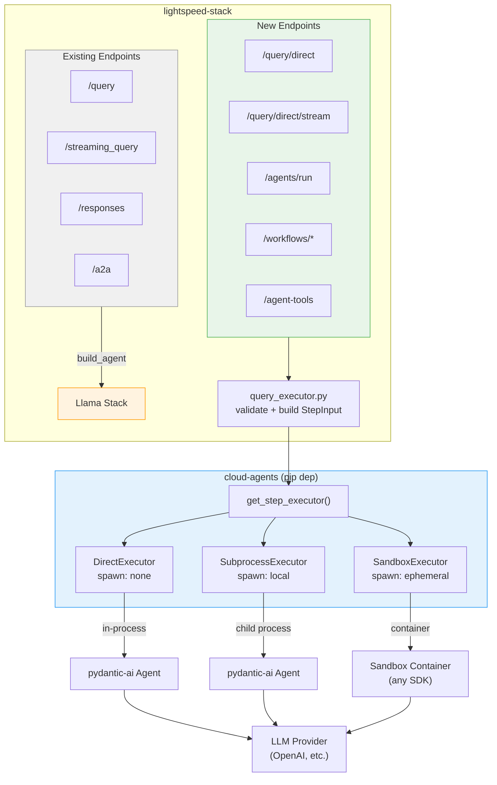
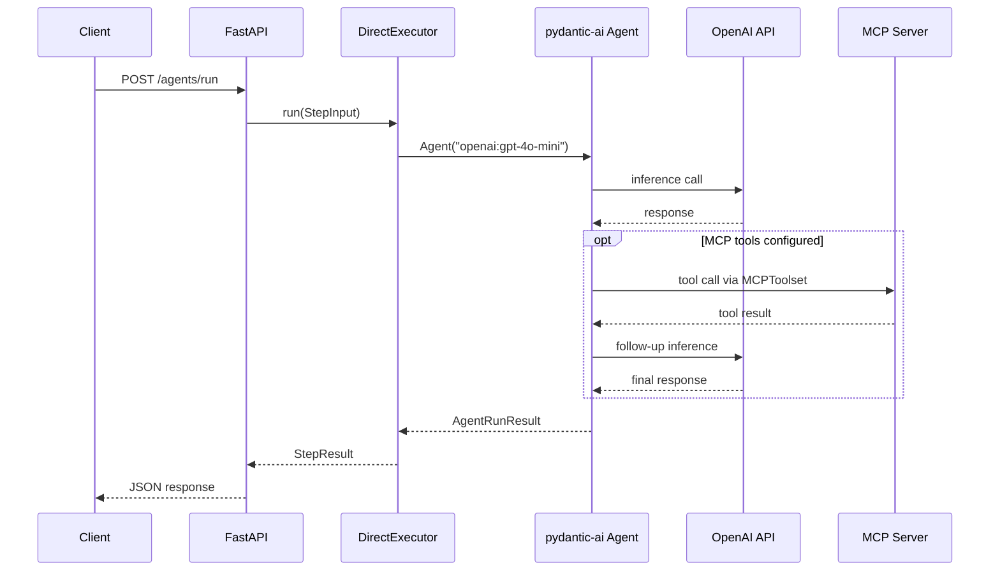
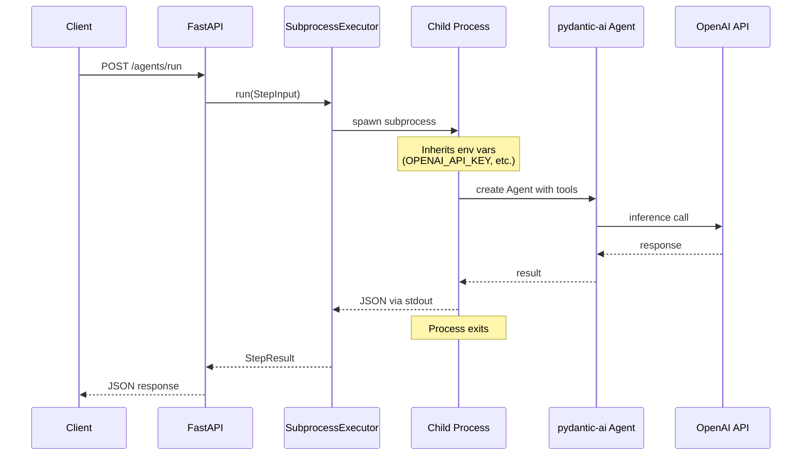
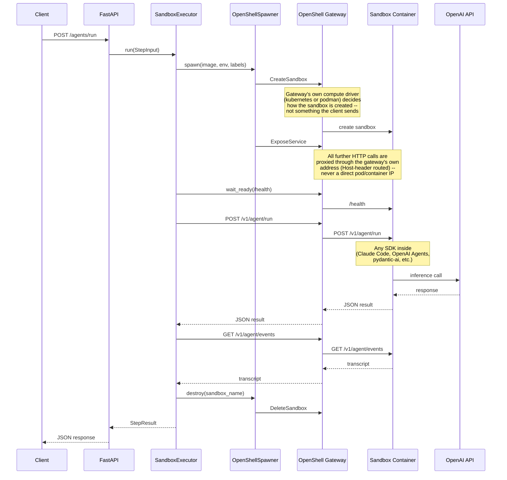
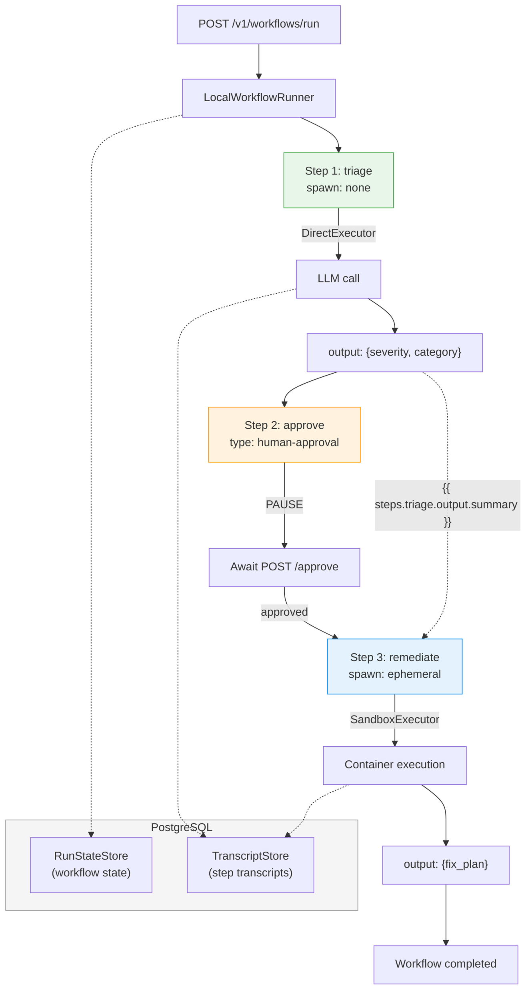
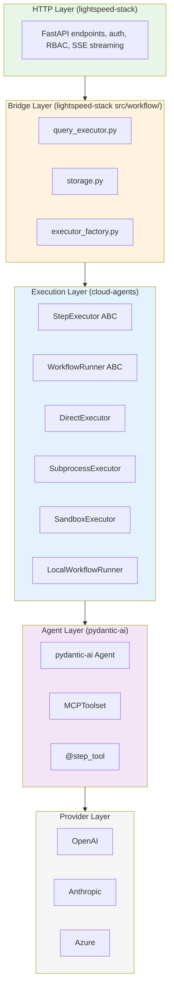
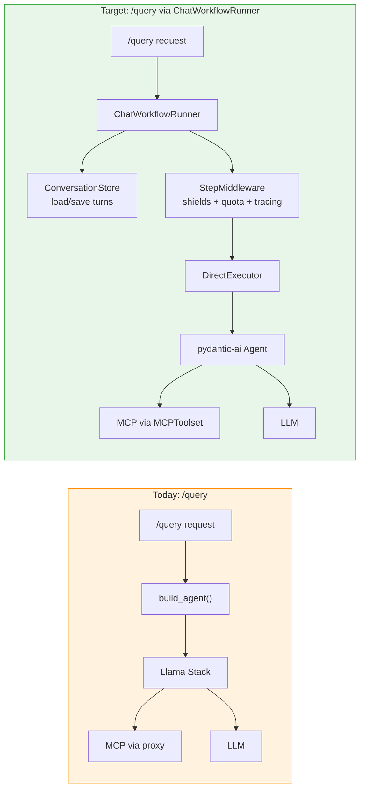
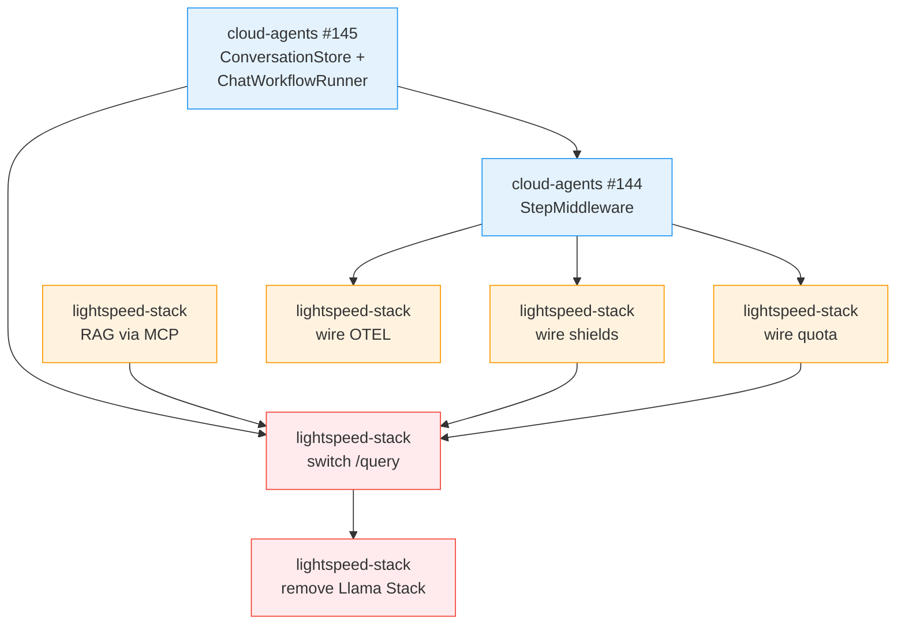

# Cloud Agents Integration Architecture

## Overview

Lightspeed-stack integrates cloud-agents as a pip dependency, gaining multi-step workflow orchestration, multi-spawn-mode agent execution, and a unified execution engine that will eventually replace the Llama Stack agent path.



## Spawn Modes

The spawn mode determines where and how an agent executes. The same agent definition runs in any mode -- the mode is an isolation choice, not a capability choice.

### spawn: none (DirectExecutor)



**When to use:** Default for all queries and workflow steps. Low latency, no infrastructure needed.

**Capabilities:** LLM, MCP tools, registered @step_tool functions, skills, streaming.

**Isolation:** None. Agent runs in the same process as the API server.

### spawn: local (SubprocessExecutor)



**When to use:** Steps with untrusted tools, crash isolation needed, or resource-intensive operations.

**Capabilities:** Same as spawn:none (LLM, MCP, tools, skills). MCP connections opened in child process.

**Isolation:** Process boundary. Child crash doesn't affect server.

### spawn: ephemeral (SandboxExecutor)



**When to use:** Full isolation needed, different agent SDK required, or agents with kubectl/filesystem access.

**Capabilities:** Determined by the container image. The sandbox is a black box.

**Isolation:** Container boundary. Network policy, filesystem, and resource limits enforced by K8s/Podman.

## Workflow Execution

Multi-step workflows are orchestrated by `LocalWorkflowRunner` (pydantic-graph) or `TemporalWorkflowRunner` (Temporal, for crash recovery).



### Step Output Chaining

Each step's output is available to subsequent steps via template interpolation:

```yaml
steps:
  - name: analyze
    prompt: "Analyze this alert: ..."
    output_key: analysis

  - name: fix
    prompt: >
      Based on the analysis:
      {{ steps.analysis.output.summary }}
      Generate a fix plan.
```

## Architecture Layers



## API Surface

| Endpoint | Method | Purpose |
|---|---|---|
| `/v1/query/direct` | POST | Blocking query via DirectExecutor |
| `/v1/query/direct/stream` | POST | SSE streaming query |
| `/v1/agents/run` | POST | Single agent execution (any spawn mode) |
| `/v1/workflows/run` | POST | Start a multi-step workflow |
| `/v1/workflows/{id}` | GET | Get workflow status |
| `/v1/workflows/{id}/approve` | POST | Approve a paused step |
| `/v1/workflows/{id}/cancel` | POST | Cancel a workflow |
| `/v1/workflows/{id}/transcripts` | GET | Get step transcripts |
| `/v1/agent-tools` | GET | List registered tools |

## Configuration

```yaml
# lightspeed-stack.yaml

workflow_engine:
  enabled: true
  max_concurrent_workflows: 10
  transcript_retention_days: 30

spawner:
  type: openshell
  sandbox_image: lightspeed-agentic-sandbox:latest
  max_pods: 10
  openshell_gateway_url: openshell-gateway:8080

mcp_servers:
  - name: kubectl
    url: http://mcp-kubectl:8080/sse
    authorization_headers:
      Authorization: /path/to/token
```

---

## Section 1: Workflows and Agent Runs

### Capability Matrix

| Capability | spawn:none | spawn:local | spawn:ephemeral | Status |
|---|:---:|:---:|:---:|---|
| LLM inference | Yes | Yes | Yes | Done |
| @step_tool functions | Yes | Yes | n/a | Done |
| MCP servers | Yes | Yes | Yes | Done |
| Skills | Yes | Yes | Yes (OCI) | Done |
| Streaming | Yes | fallback | n/a | Done |
| Output schemas | Yes | Yes | Yes | Done |
| Step chaining | Yes | Yes | Yes | Done |
| Human approval | Yes | Yes | Yes | Done |
| OTEL tracing | Yes | Yes | Yes | Done |
| Transcript capture | Yes | Yes | Yes | Done |
| RAG / file_search | - | - | - | **Gap** |
| Shields / guardrails | - | - | - | **Gap** |
| Quota enforcement | - | - | - | **Gap** |
| Conversation history | basic | - | - | **Partial** |

### Workflow Execution E2E Verified

All cloud-agents example workflows execute successfully through lightspeed-stack:

| Workflow | Steps | Spawn modes | Result |
|---|---|---|---|
| triage-classify | 3 (agent, approval, agent) | none | Pass |
| local-investigate | 4 (none, local, approval, local) | none+local | Pass |
| security-audit | 3+ | none | Pass |
| diagnostic | varies | none | Pass |
| All 10 definitions | varies | varies | Parse + first step passes |

### Remaining Gaps

**RAG / file_search** -- Not available in any spawn mode. Recommended path: deploy a vector search service as an MCP server. Steps declare `mcp_servers: [rag-service]`. No executor changes needed.

**Shields / guardrails** -- Input validation (question validity, PII redaction) not wired. Recommended: StepMiddleware (cloud-agents #144) for pre/post hooks, or endpoint-level shields as a simpler interim.

**Quota enforcement** -- Per-user token quotas not enforced. Infrastructure exists in lightspeed-stack (`src/quota/`). Wire as StepMiddleware or at endpoint level.

---

## Section 2: ChatWorkflowRunner -- Becoming the Chat Agent

### The Unification

The existing `/query` chatbot is a `spawn: none` agent with conversation management, MCP tools, RAG, shields, and streaming. Cloud-agents' planned `ChatWorkflowRunner` (#145) replaces the internal execution path.



### What's Done

| Component | Status |
|---|---|
| Agent execution via DirectExecutor | Done |
| MCP tools via pydantic-ai MCPToolset | Done |
| Streaming via run_stream() | Done |
| Skills via pydantic-ai-skills | Done |
| OTEL tracing in executor | Done |
| StepMetadata with user_id | Done |
| conversation_id load/save | Done |
| API field compatibility with /query | Done |
| /v1/agent-tools listing | Done |

### Gaps to Close

| Gap | Blocker? | Owner | Dependency |
|---|---|---|---|
| **ConversationStore ABC** | Yes | cloud-agents #145 | Shared turn-level storage interface |
| **ChatWorkflowRunner** | Yes | cloud-agents #145 | Runner for dynamic user turns |
| **StepMiddleware** | Yes | cloud-agents #144 | Pre/post hooks for cross-cutting concerns |
| **Shield implementations** | No | lightspeed-stack | Wire existing capabilities as middleware |
| **RAG** | No | Both | MCP server or inline pre-processing |
| **Compaction** | No | lightspeed-stack | Summarize old turns when context fills |
| **Splunk telemetry** | No | lightspeed-stack | Backend-specific event dispatch |
| **System prompt from config** | No | lightspeed-stack | One-line fallback to customization.system_prompt |

### Migration Path

```mermaid
graph LR
    p1["Phase 1\n/query/direct\n endpoint"]
    p2["Phase 2\nstreaming"]
    p3["Phase 3\nconversation_id"]
    p4["Phase 4\nChatWorkflow\nRunner"]
    p5["Phase 5\nStepMiddleware"]
    p6["Phase 6\nshields +\nquota"]
    p7["Phase 7\nRAG"]
    p8["Phase 8\nswitch /query\ninternals"]
    p9["Phase 9\nremove\nLlama Stack"]

    p1 --> p2 --> p3 --> p4 --> p5 --> p6 --> p7 --> p8 --> p9

    style p1 fill:#c8e6c9,stroke:#4caf50
    style p2 fill:#c8e6c9,stroke:#4caf50
    style p3 fill:#c8e6c9,stroke:#4caf50
    style p4 fill:#fff9c4,stroke:#fbc02d
    style p5 fill:#fff9c4,stroke:#fbc02d
    style p6 fill:#ffecb3,stroke:#ff9800
    style p7 fill:#ffecb3,stroke:#ff9800
    style p8 fill:#ffecb3,stroke:#ff9800
    style p9 fill:#ffecb3,stroke:#ff9800
```



Green = done. Yellow = waiting on cloud-agents. Orange = pending lightspeed-stack work.

The external API (`/query` request/response shape) remains unchanged throughout. Callers are unaffected.

### Dependency Chain



Blue = cloud-agents. Orange = lightspeed-stack. Red = final migration steps.

---

## Scaling

| Component | Multi-pod safe? | Notes |
|---|---|---|
| `/query/direct` | Yes | Stateless per call |
| `/agents/run` | Yes | Stateless per call |
| Conversation state | Yes (PostgreSQL) | Shared database |
| Workflow state | Yes (PostgreSQL) | Shared database |
| Running workflow tasks | No (in-memory) | Use Temporal for crash recovery |
| MCP connections | Yes | Opened/closed per step |
